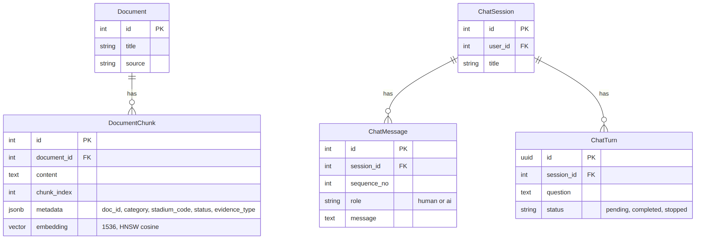

<div align="center">


# ⚾ KBO 직관 가이드 챗봇

**RAG 기반 구장 안내 · 야구 DB 조회 에이전트 · 경기 전후 직관 코스 추천**

SKN34 3차 프로젝트 · 5팀 [TODO: 팀명]


</div>

---

## 목차

1. [팀 소개](#1-팀-소개)
2. [프로젝트 기간](#2-프로젝트-기간)
3. [프로젝트 개요](#3-프로젝트-개요)
4. [경쟁 서비스 비교](#4-경쟁-서비스-비교)
5. [정책 및 신뢰성 설계](#5-정책-및-신뢰성-설계)
6. 🔴 [수집된 데이터 및 데이터 전처리](#6-수집된-데이터-및-데이터-전처리)
7. 🔴 [RAG · 에이전트 파이프라인 설계](#7-rag--에이전트-파이프라인-설계)
8. 🔴 [시스템 아키텍처](#8-시스템-아키텍처)
9. [데이터베이스 설계](#9-데이터베이스-설계)
10. [디렉토리 구조](#10-디렉토리-구조)
11. [Tech Stack](#11-tech-stack)
12. [실행 방법](#12-실행-방법)
13. [화면 설계 · UX Flow](#13-화면-설계--ux-flow)
14. [API 문서](#14-api-문서)
15. [배포 (AWS · Docker · Nginx · CI/CD)](#15-배포-aws--docker--nginx--cicd)
16. 🔴 [테스트 계획 및 결과](#16-테스트-계획-및-결과)
17. [시연 화면](#17-시연-화면)
18. [트러블 슈팅](#18-트러블-슈팅)
19. [향후 개선 계획 · 비즈니스 전략](#19-향후-개선-계획--비즈니스-전략)
20. [협업 방식](#20-협업-방식)
21. [한 줄 회고](#21-한-줄-회고)

---

## 1. 팀 소개

<!-- 프로필 이미지는 docs/images/team/ 에 넣고 경로만 바꾸면 됩니다. -->

<table>
  <tr>
    <td align="center"><br/><b>[TODO] 이름</b><br/>[TODO] 역할</td>
    <td align="center"><br/><b>이형준</b><br/>데이터 · RAG · LLM</td>
    <td align="center"><br/><b>이현준</b><br/>인프라 · CI/CD</td>
    <td align="center"><br/><b>최인영</b><br/>프론트엔드</td>
    <td align="center"><br/><b>[TODO] 이름</b><br/>[TODO] 역할</td>
  </tr>
  <tr>
    <td align="center"><a href="https://github.com/Seongho-haru"></a></td>
    <td align="center"><a href="https://github.com/HyeongJjun"></a></td>
    <td align="center"><a href="https://github.com/[TODO]"></a></td>
    <td align="center"><a href="https://github.com/inyoung9629"></a></td>
    <td align="center"><a href="https://github.com/[TODO]"></a></td>
  </tr>
</table>

<!-- 아래 표는 git 커밋 기록으로 추정한 초안입니다. 팀원 확인 후 수정하세요. -->

| 이름 | 담당 | 주요 작업 |
| --- | --- | --- |
| [TODO: 윤성호] | [TODO] 백엔드 | 인증(JWT) · 채팅 API · 코스 CRUD · 야구 SQL 조회 서비스, PR 리뷰·머지 |
| 이형준 | 데이터 · RAG · LLM | 데이터 수집·전처리, 청킹·임베딩(pgvector), RAG·에이전트 파이프라인, RAG 성능 평가 |
| 이현준 | 인프라 | Docker Compose, GitHub Actions CI/CD, EC2 배포, 구장정보(venue) 에이전트 |
| 최인영 | 프론트엔드 | Next.js 화면, 직관 코스 · 커뮤니티 · 회원 UI |
| [TODO: masquerade0425] | [TODO] DB | baseball 도메인 ERD · DB 스키마 |

---

## 2. 프로젝트 기간

**2026.08.31 ~ 2026.09.17** (약 2.5주)

<!-- 필요하면 WBS 이미지나 간트 표를 넣으세요. -->

| 기간 | 내용 |
| --- | --- |
| 08.31 ~ 09.06 | 기획, 데이터 출처 조사, API 키 발급 |
| 09.07 ~ 09.08 | 데이터 수집 · 전처리 |
| 09.09 ~ 09.10 | 청킹 · 임베딩 · 벡터 DB 적재 |
| 09.11 ~ 09.14 | RAG 체인 · 백엔드 API · 프론트 연동, RAG 평가 |
| 09.15 ~ 09.17 | 에이전트 파이프라인 통합, 배포, 문서화 |

---

## 3. 프로젝트 개요

### 3.1 프로젝트 소개

<!-- 3줄 요약: 누구를 위해 / 무엇을 / 어떻게 -->

> 야구장에 처음 가는 팬도 **"잠실 경기 전에 뭐 먹고, 주차는 어디에, 뭘 가져가면 안 돼?"** 를 한 번에 물어보고,
> **경기 전 맛집 → 경기 관람 → 경기 후 핫플레이스** 코스를 지도로 받아보는 KBO 직관 안내 챗봇입니다.

### 3.2 프로젝트 배경

<!-- 뉴스 캡처 이미지 2~3장을 docs/images/background/ 에 넣고 아래 경로를 바꾸세요. -->

<p align="center">
  
  
  
</p>

#### ① KBO 리그, 2년 연속 역대급 흥행

| 지표 | 수치 | 출처 |
| --- | --- | --- |
| 2025 시즌 총 관중 | **1,231만 2,519명** (역대 최다) | [머니투데이, 2026.09.13][mt] |
| 2026 시즌 1,100만 돌파 | **626경기 만** (2025년보다 17경기 빠름) | [중부뉴스통신, 2026.09.13][jb] |
| 2026 시즌 경기당 평균 관중 | **1만 7,651명** (2025년 1만 7,101명) | [중부뉴스통신][jb] |
| 2026 시즌 매진 경기 | 626경기 중 **298경기 (약 48%)**, 좌석 점유율 85.2% | [중부뉴스통신][jb] |

- 2026 WBC에서 대표팀이 **17년 만에 8강**에 오르며 붙은 열기가 그대로 리그로 이어졌다는 분석이 나옵니다. ([머니투데이][mt])
- 경기 시간 단축(평균 3시간 2분, 전년보다 8분 감소)과 자동 볼 판정 시스템(ABS) 도입이 빠른 경기를 좋아하는 MZ세대에게 통했다는 평가도 있습니다. ([한국경제, 2025.09.05][hk])

#### ② 새로 유입된 팬은 "야구장 초보", 그중에서도 2030 여성

| 지표 | 수치 | 출처 |
| --- | --- | --- |
| 온라인 예매자 중 여성 비율 | **57.5%** (2023년 51.4%) | [한국경제][hk] |
| 20대 예매자 중 여성 비율 | **63.6%** | [한국경제][hk] |
| 1년 사이 야구 관심이 늘었다는 20대 | **63.3%** | [2025 KBO 팬 성향 조사, 데일리비즈온 2026.01.27][fan] |
| 올해 직접 관람 경험 / 내년 관람 의향 | **61.4% / 79.9%** | [팬 성향 조사][fan] |
| 야구 정보를 모바일로 찾는 비율 | **84.3%** | [팬 성향 조사][fan] |

- 2030 여성 팬덤, 스타 선수, 캐릭터 협업 굿즈, 구단 유튜브·SNS 콘텐츠, 야구장 시설 개선이 인기 요인으로 꼽힙니다. ([마이데일리, 2025.12.06][md])

#### ③ 직관은 "경기 관람"이 아니라 "먹고 · 놀고 · 자는 여행"

| 원정 팬 행동 (야놀자리서치) | 비율 |
| --- | --- |
| 경기 전 간식 · 식사 구매 | **76%** |
| 지역 카페 · 맛집 방문 | **60%** |
| 경기 후 외식 / 주점 | **46% / 40%** |
| 부산 원정 팬 숙박 전환율 | **86.8%** |

출처: [이투데이, 2025.10.06][et]

- 현대경제연구원은 프로야구로 생기는 연간 소비 지출 효과를 **약 1조 1,121억 원**으로 추산했습니다. ([위키트리, 2026.04.25][wt])

### 3.3 문제 정의

<!-- 배경 → 우리가 본 불편함 → 그래서 필요한 것 -->

| 사용자가 겪는 불편 | 현재 상황 |
| --- | --- |
| 구장 정보가 흩어져 있음 | 반입 규정 · 주차 · 좌석 · 재입장 규정이 **10개 구단 홈페이지에 제각각** 있고, 일부는 공식 자료가 없음 |
| 맛집 · 코스는 따로 찾아야 함 | 구장 정보는 구단 사이트, 주변 맛집은 지도 앱, 일정 · 순위는 포털에서 따로 확인 |
| 초보 팬은 무엇을 물어야 할지 모름 | "라팍", "챔필", "엔팍" 같은 별칭과 구단마다 다른 좌석 등급명 |
| 비공식 정보의 신뢰도 | 블로그 · 커뮤니티 정보와 공식 정보가 섞여 있어 믿고 따르기 어려움 |

> **→ 구장 정보, 경기 데이터, 주변 장소를 한 대화에서 묻고, 근거 등급까지 알려주는 직관 안내 챗봇이 필요합니다.**

### 3.4 핵심 기능

| 기능 | 설명 |
| --- | --- |
| 💬 구장 안내 Q&A (RAG) | 교통 · 주차 · 좌석 · 가격 · 반입 · 재입장 · 편의시설을 문서 검색으로 답변 |
| 📊 경기 데이터 조회 | 일정 · 순위 · 티켓 가격을 **읽기 전용 DB 조회 도구**로 정확히 답변 |
| 🗺️ 직관 코스 추천 | 경기 전 맛집 → 구장 → 경기 후 코스를 만들고 **카카오맵에 자동 표시** |
| 🏷️ 근거 등급 표시 | 공식 / 공식 확인 전 / 비공식 / 외부 서비스 정보에 따라 말투를 다르게 |
| 👥 커뮤니티 · 코스 공유 | [TODO] 게시판, 승부 예측, 코스 저장 · 공유 |

### 3.5 기대 효과

- [TODO] 초보 팬의 직관 준비 시간 단축
- [TODO] 원정 팬의 체류형 소비를 구장 주변 상권으로 연결
- [TODO] 공식 · 비공식 정보를 구분해 잘못된 안내로 인한 현장 혼란 감소

---

## 4. 경쟁 서비스 비교

<!-- 서비스별로 주요 기능 / 강점 / 한계점 3줄씩 쓰고 마지막에 비교표 -->

#### [TODO] 서비스 A (예: 구단 공식 앱)
- **주요 기능**:
- **강점**:
- **한계점**:

#### [TODO] 서비스 B (예: 포털 스포츠)
- **주요 기능**:
- **강점**:
- **한계점**:

#### [TODO] 서비스 C (예: 좌석 시야 서비스)
- **주요 기능**:
- **강점**:
- **한계점**:

| 비교 항목 | **우리 서비스** | 서비스 A | 서비스 B | 서비스 C |
| --- | --- | --- | --- | --- |
| 10개 구단 구장 정보 통합 | ✓ | ✗ | [TODO] | [TODO] |
| 대화형 질의응답 | ✓ | [TODO] | [TODO] | [TODO] |
| 경기 전후 코스 추천 · 지도 | ✓ | [TODO] | [TODO] | [TODO] |
| 정보 신뢰도(근거 등급) 표시 | ✓ | [TODO] | [TODO] | [TODO] |

---

## 5. 정책 및 신뢰성 설계

### 5.1 데이터 수집 정책
<!-- robots.txt 확인 결과, 크롤링 제외 도메인, 수동 조사로 대체한 항목 -->
- [TODO] KBO 공식 홈페이지는 robots.txt 확인 후 수집 대상에서 제외
- [TODO] 구단 홈페이지별 접근 가능 여부 개별 확인
- [TODO] 응원가 등 저작권 이슈 데이터 제외

### 5.2 근거 등급 (답변 신뢰성)

| 등급 | 기준 (`status` · `evidence_type`) | 답변 방식 |
| --- | --- | --- |
| OFFICIAL | 구단 공식 · CONFIRMED | 단정해서 안내 |
| UNCERTAIN | PARTIAL · RECHECK 등 | "공식 확인 전 정보라 달라질 수 있습니다" |
| UNOFFICIAL | 블로그 · SNS 조사 | "비공식 정보라 현장과 다를 수 있습니다"로 시작 |
| THIRD_PARTY | 카카오 등 외부 API | "외부 서비스 기준 정보라 방문 전 확인을 권합니다" |

### 5.3 DB 조회 안전장치
<!-- 읽기 전용 계정, SQL 검증기, 타임아웃, 최대 행 수 -->
- [TODO]

---

## 6. 수집된 데이터 및 데이터 전처리

> 🔴 필수 산출물 · 상세 문서: [`data/preprocessed/README.md`](./data/preprocessed/README.md)

### 6.1 데이터 출처

| 출처 | 수집 방식 | 활용 | 비고 |
| --- | --- | --- | --- |
| 구단 공식 홈페이지 | 수동 조사 → xlsx | 좌석 · 가격 · 교통 · 편의시설 | OFFICIAL |
| TVING 내부 API | 스크립트 | 팀 순위 · 경기 일정 | 매일 갱신 |
| yagu.today | 크롤링 | 예매 정책 | |
| Kakao Local API | REST API | 구장 반경 음식점 · 카페 · 명소 | THIRD_PARTY |
| 자리어때 | [TODO] | 구장 내 먹거리 · 편의시설 위치 | |
| 블로그 · SNS | 수동 조사 | 재입장 규정 | UNOFFICIAL |

### 6.2 데이터 현황

<!-- data/preprocessed CSV 행 수 표. 최종 develop 기준으로 다시 세서 채우세요. -->

| 파일 | 행 수 | 카테고리 |
| --- | --- | --- |
| [TODO] | | |

### 6.3 전처리 파이프라인

<p align="center"></p>

### 6.4 전처리 규칙
- [TODO] 원본(`data/raw`)은 수정하지 않고 결과만 `data/preprocessed`에 저장
- [TODO] 팀 코드 표준화 (LG, DOOSAN, KIWOOM, SSG, KT, HANWHA, SAMSUNG, KIA, LOTTE, NC)
- [TODO] CSV는 `utf-8-sig`, 모든 행에 `status` · `evidence_type` 태깅

### 6.5 청킹 · 임베딩

| 항목 | 설정 |
| --- | --- |
| 청킹 방식 | [TODO] 1행 = 1청크 (행 → 자연어 문장) |
| 임베딩 모델 | [TODO] |
| 벡터 DB | [TODO] |
| 총 청크 수 | [TODO] |
| `doc_id` 규칙 | [TODO] |

---

## 7. RAG · 에이전트 파이프라인 설계

> 🔴 필수 산출물 · 코드: [`backend/llm/rag/`](./backend/llm/rag/), 인덱싱: [`build_index.py`](./backend/llm/management/commands/build_index.py)

### 7.1 전체 흐름

<p align="center"></p>

```
[TODO] 질문 → dispatcher → retrieve → build_prompt → agent(도구 호출) → parse_output → persona
```

### 7.2 에이전트 도구

| 도구 | 읽는 곳 | 용도 |
| --- | --- | --- |
| [TODO] | | |

### 7.3 프롬프트 설계
<!-- 시스템 규칙, 근거 등급별 말투, 숫자 원문 보존 등 -->
- [TODO]

### 7.4 코스 추천 흐름

<p align="center"></p>

---

## 8. 시스템 아키텍처

> 🔴 필수 산출물

<p align="center"></p>

<!-- 인터랙티브 버전: docs/diagrams/*.html (브라우저로 열기) -->

---

## 9. 데이터베이스 설계

<p align="center"></p>

| 영역 | 주요 테이블 |
| --- | --- |
| 벡터 검색 | [TODO] `llm_document`, `llm_documentchunk` |
| 채팅 | [TODO] |
| 야구 데이터 | [TODO] |
| 회원 · 커뮤니티 · 코스 | [TODO] |

---

## 10. 디렉토리 구조

```text
SKN34-3rd-5Team/
├── backend/            # [TODO]
│   ├── accounts/
│   ├── baseball/
│   ├── community/
│   ├── llm/
│   │   └── rag/
│   ├── travel/
│   ├── crawling/
│   └── preprocessing/
├── frontend/           # [TODO]
├── data/
│   ├── raw/
│   └── preprocessed/
├── docs/
├── rag_test/           # [TODO]
├── nginx/
├── .github/workflows/
└── docker-compose.yml
```

---

## 11. Tech Stack

| 분류 | 기술 |
| --- | --- |
| Frontend | [TODO] |
| Backend | [TODO] |
| LLM · RAG | [TODO] |
| Database | [TODO] |
| Infra | [TODO] |
| External API | [TODO] |
| Collaboration | [TODO] |

---

## 12. 실행 방법

```bash
# 1. 환경변수
cp .env.example .env   # [TODO] 필수 키 목록

# 2. 컨테이너 실행
docker compose up -d --build

# 3. RAG 인덱스 생성
docker compose exec backend python manage.py build_index

# 4. 접속
# [TODO]
```

---

## 13. 화면 설계 · UX Flow

<p align="center"></p>

| 화면 | 설명 | 캡처 |
| --- | --- | --- |
| [TODO] 메인 | | |
| [TODO] 챗봇 | | |
| [TODO] 직관 코스 | | |
| [TODO] 구장 정보 | | |
| [TODO] 커뮤니티 | | |

---

## 14. API 문서

- OpenAPI: [`contracts/openapi.yaml`](./contracts/openapi.yaml)
- Postman: [`docs/postman/`](./docs/postman/)

| Method | Endpoint | 설명 |
| --- | --- | --- |
| [TODO] | | |

---

## 15. 배포 (AWS · Docker · Nginx · CI/CD)

<!-- develop push → CI(Django check, Next build) → CD(EC2 SSH 배포) 흐름 -->

- [TODO]

---

## 16. 테스트 계획 및 결과

> 🔴 필수 산출물 · 코드: [`rag_test/`](./rag_test/)

### 16.1 테스트 계획

| 구분 | 대상 | 방법 | 지표 |
| --- | --- | --- | --- |
| 검색 성능 | [TODO] | 골든셋 | Hit@1 · Hit@5 · MRR |
| 생성 성능 | [TODO] | 골든셋 · 규칙 기반 채점 | 정답률 · 환각(지어냄) · 오거절 |
| 단위 · 통합 테스트 | [TODO] | unittest · node --test | 통과 여부 |
| 사용자 시나리오 | [TODO] | 수동 QA | 기대 결과 일치 |

### 16.2 골든셋 구성
- [TODO] 문항 수, 질문 그룹(일정 · 순위 · 가격 · 반입 · 거절 · 함정 · 모호 …)

### 16.3 검색 성능 결과

| 설정 | Hit@1 | Hit@5 | MRR |
| --- | --- | --- | --- |
| [TODO] | | | |

### 16.4 생성 성능 결과

| 모드 | 정답 | 오답 | 지어냄 | 오거절 |
| --- | --- | --- | --- | --- |
| [TODO] | | | | |

### 16.5 테스트 시나리오 (Test Case)

| No | 시나리오 | 입력 | 기대 결과 | 결과 |
| --- | --- | --- | --- | --- |
| TC-01 | [TODO] 경기 수 조회 | | | ✅ |
| TC-02 | [TODO] 구장 주차 | | | ✅ |
| TC-03 | [TODO] 코스 추천 · 지도 표시 | | | ✅ |
| TC-04 | [TODO] 비공식 정보 경고 | | | ✅ |
| TC-05 | [TODO] 자료 없는 질문 거절 | | | ✅ |
| TC-06 | [TODO] 야구와 무관한 질문 | | | ✅ |

---

## 17. 시연 화면

<!-- GIF 추천: docs/images/demo/*.gif -->

| 기능 | 시연 |
| --- | --- |
| [TODO] |  |

---

## 18. 트러블 슈팅

<!-- 문제 → 원인 → 해결 → 결과 형식으로 3~5개 -->

<details>
<summary><b>① [TODO] 문제 제목</b></summary>

- **문제**:
- **원인**:
- **해결**:
- **결과**:

</details>

<details>
<summary><b>② [TODO] 문제 제목</b></summary>

- **문제**:
- **원인**:
- **해결**:
- **결과**:

</details>

<details>
<summary><b>③ [TODO] 문제 제목</b></summary>

- **문제**:
- **원인**:
- **해결**:
- **결과**:

</details>

---

## 19. 향후 개선 계획 · 비즈니스 전략

### 19.1 모델 · 서비스 고도화
- [TODO]

### 19.2 실제 서비스 적용 시 추가 기능
- [TODO]

### 19.3 적용 가능한 곳 · 비즈니스 모델
- [TODO]

---

## 20. 협업 방식

- **Git 전략**: [TODO] Fork → `feat/*` 브랜치 → `develop` PR → 팀장 리뷰 후 Squash merge
- **커밋 규칙**: `type: 한글 작업 내용` (`feat` · `fix` · `refactor` · `docs` · `test` · `chore`)
- **도구**: [TODO] GitHub · Notion · Discord
- **협업 중 문제와 해결**: [TODO]

---

## 21. 한 줄 회고

| 이름 | 회고 |
| --- | --- |
| [TODO] | |
| 이형준 | |
| 이현준 | |
| 최인영 | |
| [TODO] | |

---

<!-- 참고 자료 링크 -->
[mt]: https://www.mt.co.kr/sports/2026/09/13/2026091215014823882
[jb]: https://www.jungbunews.com/news/articleView.html?idxno=2724260
[hk]: https://www.hankyung.com/article/2025090560771
[fan]: https://www.dailybizon.com/news/articleView.html?idxno=61642
[md]: https://v.daum.net/v/20251206090114369
[et]: https://www.etoday.co.kr/news/view/2512560
[wt]: https://www.wikitree.co.kr/articles/1133450
